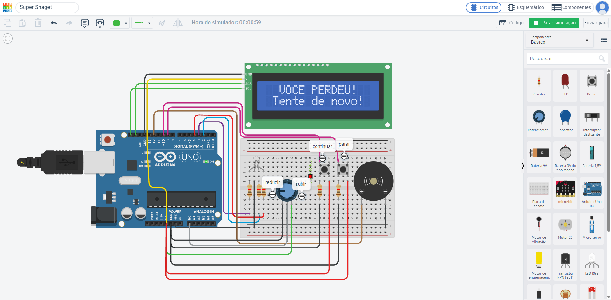

# 🎰 Mini Cassino com Arduino (Simulação Tinkercad)

Projeto de um sistema interativo de Mini Cassino desenvolvido em C++ para Arduino UNO dentro do ambiente Tinkercad. O circuito conta com interface via LCD 16x2, controle analógico de apostas via potenciômetro, feedback visual RGB e sonoro via buzzer.

---

## 🎓 Contexto do Projeto
Este projeto foi desenvolvido como parte do aprendizado prático de **Hardware e Internet das Coisas (IoT)** no curso de **Análise e Desenvolvimento de Sistemas (ADS) do SENAI**. 
* **Nota de Desenvolvimento:** O circuito e a lógica foram criados de forma inteiramente manual, utilizando pesquisas em documentações e consultas de código C++ para consolidação do aprendizado técnico, sem o uso de ferramentas de IA generativa.

---

## 🛠️ Funcionalidades

* **Ajuste Dinâmico de Aposta:** O potenciômetro mapeia em tempo real os valores de aposta (variando de R\$ 5 a R\$ 100).
* **Controle do Sistema:** Botões físicos para confirmar aposta/reiniciar o jogo (`Continuar`) e para desligar o sistema (`Parar`).
* **Animações e Áudio Integrados:**
  * **Durante a Roleta:** O LED RGB alterna de cor em sincronia com a mudança de pitch (frequência) do buzzer.
  * **Vitória:** Efeito comemorativo com o LED RGB piscando em alta velocidade e tom agudo no buzzer.
  * **Derrota:** LED completamente desligado e um tom grave contínuo no buzzer.
* **Controle da Banca (House Edge):** Configuração estruturada no código para gerenciamento das regras de ganho e perda.

---

## 🔌 Componentes e Pinagem

| Componente | Pino Arduino | Descrição |
| :--- | :--- | :--- |
| **LCD 16x2 (I2C)** | SDA / SCL (I2C) | Exibição de mensagens, status e valores de aposta |
| **Potenciômetro** | `A0` | Seleção analógica do valor da aposta |
| **Botão Continuar** | `Pino 10` | Confirma a jogada atual / Liga o sistema |
| **Botão Parar** | `Pino 9` | Desliga o sistema e interrompe os componentes |
| **Buzzer Piezo** | `Pino 12` | Feedback sonoro do jogo e alertas |
| **LED RGB (R)** | `Pino 3` | Canal Vermelho (Red) |
| **LED RGB (G)** | `Pino 4` | Canal Verde (Green) |
| **LED RGB (B)** | `Pino 2` | Canal Azul (Blue) |

---

## 📸 Imagens do Circuito

Aqui estão as demonstrações visuais do funcionamento do projeto:

### Tela Inicial

### Giro da Roleta

### Resultado: Vitória

### Resultado: Derrota

---

##  Como Executar

### Pré-requisitos
Você vai precisar de uma conta gratuita no [Tinkercad](https://www.tinkercad.com/).

### Passo a Passo
1. Abra o **Tinkercad Circuits**.
2. Monte o circuito seguindo estritamente a tabela de pinagem e as imagens ilustrativas acima.
3. Abra o editor de código do Tinkercad e mude o modo de visualização para **Texto**.
4. Copie todo o conteúdo do arquivo `CASSINO_NYCOLAS.c++` (ou `.ino`) disponível neste repositório.
5. Cole o código no editor do Tinkercad e clique em **Iniciar Simulação**.
